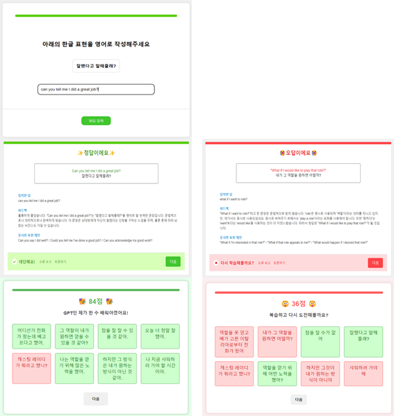
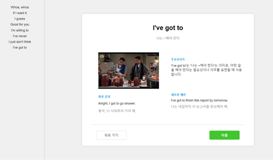
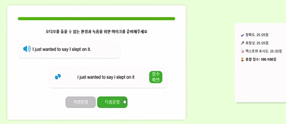
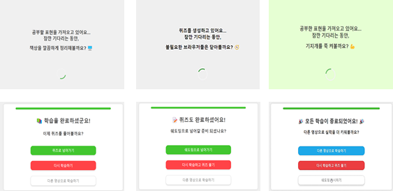

# 🤖LangBot : 유튜브 기반 영어 학습 서비스

LangBot은 원하는 **유튜브 영상**으로 영어 `표현 학습`, `퀴즈`, `발음 연습`까지 제공하는 **맞춤형 영어 학습 플랫폼**입니다. 

 

*💡본 레포지토리는 랭봇의 <u>프론트엔드</u> 저장소입니다*

 

## 🎯개발 배경
"영어 공부 어떻게 해야하죠....."🥲

 

1. 기존 영어 학습 서비스 문제점
   - **제휴 콘텐츠에 의존**하여 학습 자료가 제한되어 있습니다
   - **학습 과정이 일반화**되어 있어 개인 맞춤형 학습에 한계가 있습니다

2. 혼자서 공부할 때의 문제점
   - 모르는 표현을 찾기 위해 반복되는 작업(`일시 정지`-`자막 전환`-`사전 검색`)으로 **학습 흐름이 방해**됩니다
   - 체계적인 학습 **전략이 없기에** 유튜브의 방대한 콘텐츠를 효과적으로 활용하기 어렵습니다

 

😎🙌이러한 문제를 해결하기 위해 **1️⃣개인의 수준**과 **2️⃣원하는 학습량**에 맞춰 **3️⃣원하는 유튜브 콘텐츠**를 통해 영어를 공부할 수 있는 영어 학습 서비스, Langbot을 개발했습니다

 

## 📌서비스 핵심 기능
1. 학습 맞춤 설정
   - 공부하고 싶은, 원하는 **유튜브 영상의 URL**을 입력합니다
   - 학습할 표현 **개수**와 **난이도**(걸음마, 초급, 중급, 고급)를 설정합니다

2. 표현 학습 `OpenAI` `Youtube-Transcript`
   - 선택한 유튜브 영상에 대한, 선택한 난이도와 개수에 해당하는 **학습 표현**이 생성됩니다
   - 학습 표현의 원본문장, 의미, 사용목적과 문법적 특징, 새로운 예문이 함께 제공됩니다
   - 학습 표현이 해당된 유튜브 영상 구간이 자동으로 재생됩니다
 

3. 퀴즈 및 피드백  `OpenAI`
   - 학습 표현을 기반으로 사용자가 영작을 하는 형식의 **퀴즈가 생성**됩니다
   - 사용자의 답변에 대한 문법적, 문맥적인 **피드백**과 유사표현을 제공합니다
   - 퀴즈가 끝난 이후에 직관적인 결과 화면을 통해 점수와 문제를 확인할 수 있습니다

4. 섀도잉 `Azure TextToSpeech` `Azure SpeechToText` `Azure Pronunciation Assessment` 
   - 학습 표현의 원본 문장을 한 문장씩 듣고, 따라 말하고, 평가를 받을 수 있습니다
   - 원어민 음성으로 원본 문장을 청취합니다
   - 사용자는 직접 따라 말해봅니다. 따라 말하는 즉시, 음성이 **텍스트로 변환**되어 정확하게 말했는지 확인할 수 있습니다. 
   - 따라 말하는 것이 끝나면 점수로 **발음에 대한 평가**를 받습니다 (정확도, 유창성, 텍스트와의 유사도, 종합점수)

5. 사용자 학습 흐름 최적화를 위한 페이지
- 학습 콘텐츠가 준비되는 동안 사용자가 이탈하지 않도록 "책상을 깔끔하게 정리해 볼까요" 등의 문구와 함께 스피너가 돌아가, 로딩 시간을 긍정적으로 인식하도록 유도하였습니다
- 각 학습 단계가 종료될 때에는 `다음 학습 단계로` 진행하거나, `동일 학습을 반복`하거나, `새로운 영상 url을 입력`할 수 있는 선택지를 제공하여 사용자가 상황에 맞게 적합한 학습 단계를 스스로 선택할 수 있도록 돕습니다

 

## 🛠️기술 스택
- **프론트엔드** Flask HTML CSS JavaScript
- **백엔드** NodeJS ExpressJS
- **API**
  - [YouTube Transcript API](https://github.com/jdepoix/youtube-transcript-api): 자막 데이터 추출 및 영상 재생 구간 계산
  - [OpenAI API](https://openai.com/api/): 학습 표현, 퀴즈 생성 및 피드백 제공
  - [Azure Speech Services](https://azure.microsoft.com/en-us/products/cognitive-services/speech-services/): TTS, STT, 발음 평가
